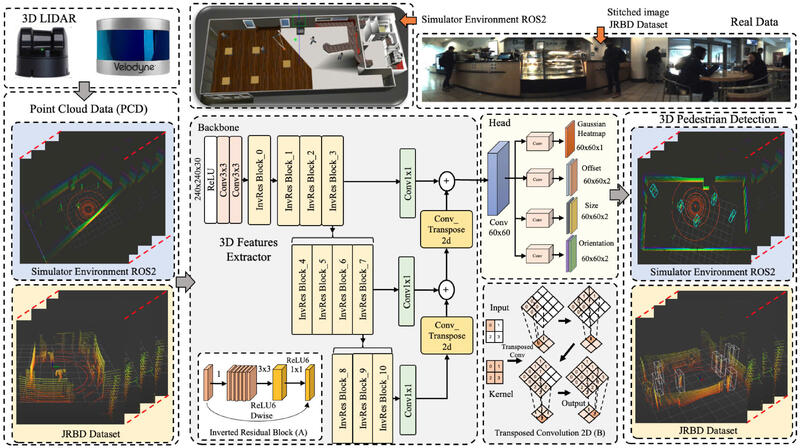

This repo is implementation of IRBGHR-PIXOR model presented in the  [Enhancing Indoor Robot Pedestrian Detection Using Improved PIXOR Backbone and Gaussian Heatmap Regression in 3D LiDAR Point Clouds](https://ieeexplore.ieee.org/abstract/document/10385189)



# Launch
Make should you have installed the JRDB at https://jrdb.erc.monash.edu/ and pasted to data folder with the following structure:
```
├── data
│   ├── 2011_09_26
│   │   └── 2011_09_26_drive_0001_sync
│   └── train_dataset_with_activity
│       ├── calibration
│       │   └── indi2stitch_mappings
│       ├── detections
│       │   ├── detections_2d
│       │   ├── detections_2d_stitched
│       │   └── detections_3d
│       ├── images
│       ├── labels
│       └── pointclouds
│           ├── lower_velodyne 
│           └── upper_velodyne
└── src
```
Then clone this repo and https://github.com/KoaBou/JRDB_publishers.git to src folder and run
```
colcon build 
```
to build the model. 

If you can't install ros-foxy-vision-msgs then clone this repo to your src 
https://github.com/ros-perception/vision_msgs

Make sure you source the workspace with
```
source install/setup.bash
```

Finally, launch the package with
```
ros2 launch pedestrian_detection coffe_detection.launch.py
```

# Results

[](https://www.youtube.com/watch?v=QfDBbdK9qXw)
